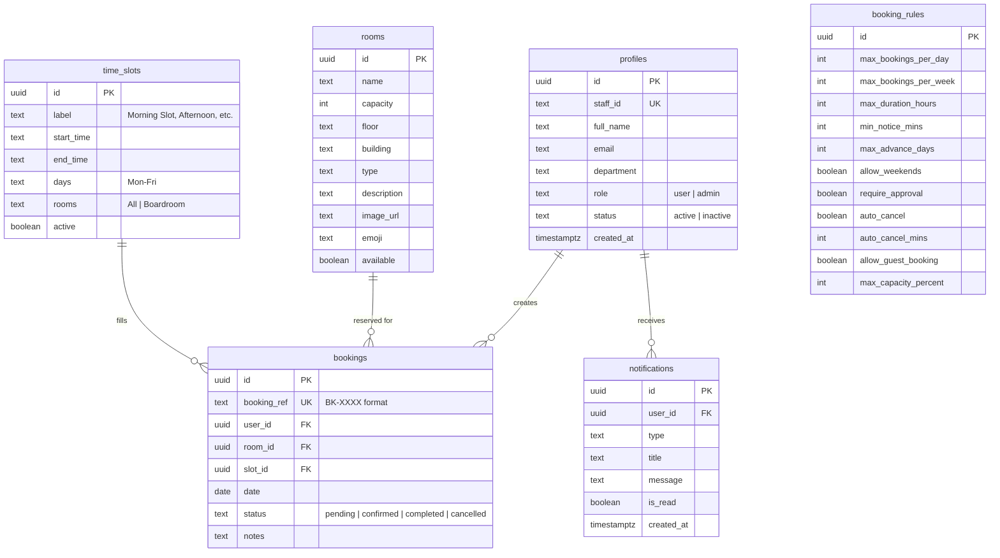
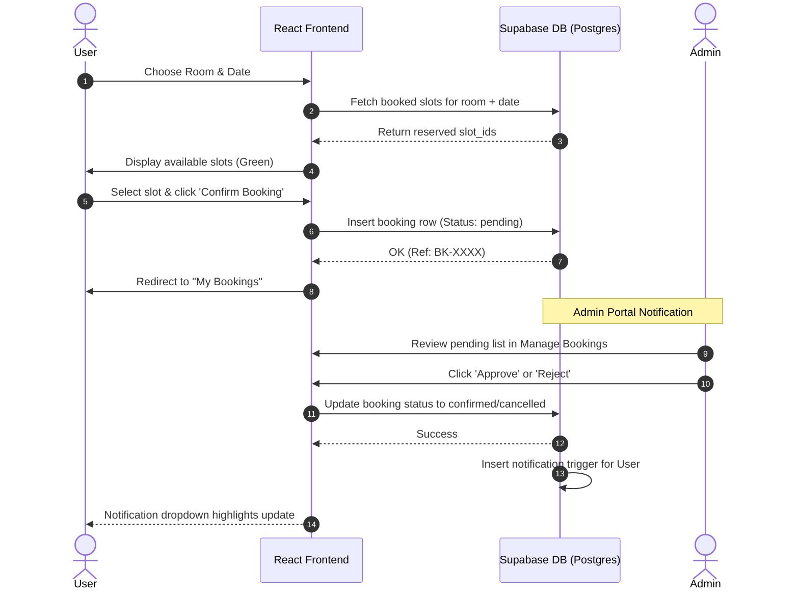

# JOBOOK — Spatial Room Booking System
## Proof of Concept (PoC) Documentation

JOBOOK is a modern, premium, and feature-rich Web Application designed for managing rooms, halls, and meeting slots in institutional and corporate environments. This Proof of Concept (PoC) is built on a modern React + Vite frontend and integrated directly with Supabase for databases, real-time sync, Row-Level Security (RLS), and database trigger workflows.

---

## 1. Technology Stack

The PoC implements a robust and fast-loading stack utilizing:
*   **Frontend Library**: **React 19** with Fast Refresh and Hot Module Replacement (HMR) powered by **Vite 8**.
*   **Routing**: **React Router DOM 7** with declarative private route protection mapping `user` vs `admin` accessibility.
*   **Database & Auth**: **Supabase Suite** providing:
    *   PostgreSQL relational engine.
    *   Supabase Auth (JSON Web Tokens with email-based authentication).
    *   Row-Level Security (RLS) to enforce data privacy directly on the database level.
    *   Triggers and sequences for auto-generating formatted booking codes (e.g., `BK-0200`).
*   **Styling & Theme**: Vanilla CSS custom variables system supporting fully integrated, smooth transition **Light & Dark modes** with glassmorphism aesthetics.
*   **Visualization & Export**:
    *   **Recharts** for rendering high-fidelity interactive SVG graphs.
    *   **SheetJS (XLSX)** for compile-free client-side binary spreadsheet generation.

---

## 2. System Architecture & Database Schema

The database model is defined inside [schema.sql](file:///c:/JOBOOK/supabase/schema.sql) and enforces referential integrity. Here is a summary of the tables and operations:



### Critical Security & Automation Layer (RLS & Triggers)
1.  **Row-Level Security**:
    *   `profiles`: Users can view/modify only their profile. Admins can view/update all.
    *   `bookings`: Users can query their own bookings and submit slot insert requests. Admins have access to CRUD all rows.
2.  **Auth Sync Trigger**: A PostgreSQL trigger `on_auth_user_created` calls the `handle_new_user()` function to automatically populate `profiles` when a user registers on Supabase Auth.
3.  **Unique Booking Reference Sequence**:
    *   Creates a sequence `booking_seq` starting at 200.
    *   Default string expression automatically serializes `booking_ref` in format: `'BK-' || to_char(nextval('booking_seq'), 'FM0000')`.

---

## 3. Workflow Implementation

### Room Booking Cycle



---

## 4. Key PoC Features Explored

### A. Authentication & Authorization
*   **User Portal**: Restricts login to `role = 'user'`.
*   **Admin Portal**: Restricts login to `role = 'admin'` using an administrative middleware verify filter ([App.jsx](file:///c:/JOBOOK/src/App.jsx#L34-L41)).
*   **Password Resets**: Direct connection with Supabase SMTP relay.

### B. User Dashboard & Booking Scheduler
*   Interactive UI showing a **MiniCalendar** with visual date flags.
*   Divided slot selection (Morning Slots vs Afternoon Slots) with instant vacancy status indicators (Available, Reserved, Closed).
*   Sticky reservation verification bar.

### C. Admin Operations Control Panel
*   **Dashboard Charts**: Utilizes `recharts` to display real-time histograms tracking weekly slot utilization (Pending vs Confirmed).
*   **Booking Management**: Displays search filters for dates/names, custom actions to approve/reject bookings, and direct action to download reports.
*   **Excel Export Engine**: Formats column width attributes, maps metadata rows, and triggers in-browser client download file `jobook-bookings-YYYY-MM-DD.xlsx`.
*   **Granular Rules Panel**: Live configuration hooks to set limits such as *Max Bookings/Day*, *Weekend Allowances*, *Notice Durations*, and *No-Show Thresholds*.

---

## 5. Deployment & Setup Instructions

### Environment Variables
Configure a `.env` file at the root level directory with the following credentials:
```env
VITE_SUPABASE_URL=https://your-supabase-project-id.supabase.co
VITE_SUPABASE_ANON_KEY=your-supabase-anonymous-api-key
```

### Installation & Startup
Run the following commands in sequence:
```bash
# Install dependencies
npm install

# Run Vite in local development mode
npm run dev
```

### Database Initialization
1.  Navigate to your **Supabase Dashboard** -> **SQL Editor**.
2.  Paste the contents of [supabase/schema.sql](file:///c:/JOBOOK/supabase/schema.sql) and click **Run**.
3.  The schema contains initial seed data including a default video editing room and sample morning/afternoon time slots to make testing immediate.
